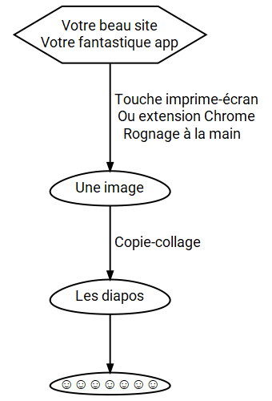
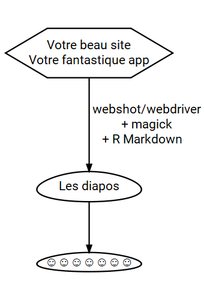

# {.col-1}

## Le défi

```{r, echo = FALSE}
DiagrammeR::grViz("problem.gv")
```

# {.col-2}

## Approche 1: à la main 

```{r, echo = FALSE}
source("make_gvs.R")
```
<p style="text-align:middle;"></p>

<br/>

<font size="10">`r icon::fa('hand-scissors')` Et à chaque changement de l'outil... on recommence tout ! `r icon::fa('meh')`</font>

# {.col-2}

## Approche 2: avec R

<p></p>

<br/>

<font size="10">`r icon::fa('r')` Et à chaque changement de l'outil... on re-tricote ("knit") ! `r icon::fa('smile')`</font>

# {.col-1}

## Outils de captures d'écran
<font size="10">
Il faut un __webdriver__ ("explorateur") et un __webdriver client__ (qui sert d'interface pour le webdriver): PhantomJS via `webshot`, Selenium via `RSelenium`/`seleniumPipes`... le __paquet `webdriver`__ est l'interface du futur ! (https://github.com/rstudio/webdriver)

`webshot` ou autre permet l'**interaction** avec ou sans JavaScript.
Pour bien viser une partie de l'écran, capture d'__éléments CSS__, ou alors __rognage et autres manipulations d'image via `magick`__ (https://github.com/ropensci/magick).

</font>

## Conclusion

- <font size="10">On peut tout faire avec R !</font>
- <font size="10">Oui il faut écrire du code mais ça a ses avantages: __reproducibilité, apprentissage de nouveaux outils__ (CSS, `magick`...).</font>
- <font size="10">Les captures d'écran peuvent faire partie de tests (cf `shinytest` de RStudio).</font>

## Méta-infos

```{r, echo = FALSE}
library("magrittr")
magick::image_read("images/logo.png") 
```


- <font size="10">Ce poster a été réalisé avec `R Markdown`, et `drposter` de Ben Bucior (https://github.com/bbucior/drposter). </font>
- <font size="10">Icônes FontAwesome v5.0.13 fontawesome.com, importées avec le paquet `icon` (https://github.com/ropenscilabs/icon).</font>
- <font size="10">Les diagrammes sont faits en `GraphViz` utilisé via le paquet `DiagrammeR` de Richard Iannone (http://rich-iannone.github.io/DiagrammeR/).</font>
- <font size="10">rOpenSci (https://ropensci.org) est une organisation pour la science ouverte et reproductible avec R. Jetez un oeil à tous nos paquets dont `magick` via https://ropensci.org/packages !</font>
